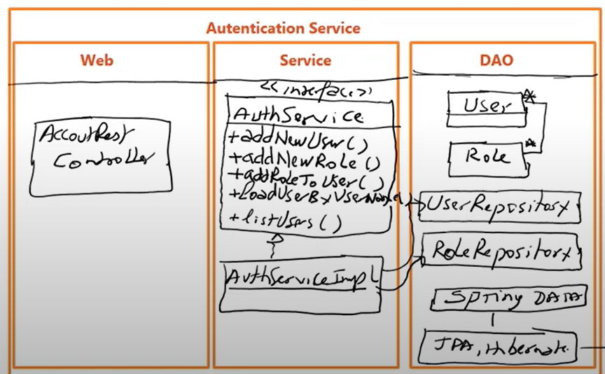

# spring-boot-sec-service

# h2-console :
http://localhost:8080/h2-console/
- user : sa
- mdp  : 

# Authentification de spring security :
- La premiere connextion utilisé user/mdp : Using generated security password: prendre de la console

- Il faut décativé la protection crsf :
http.csrf().disable();

- frams : désactivé la protection contre les frams
http.headers().frameOptions().disable();
# URLS 
- http://localhost:8080/users

# Architecture 

